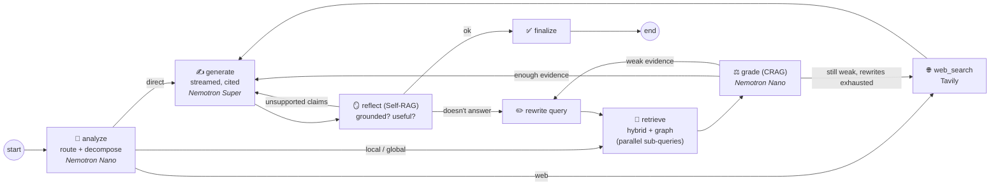
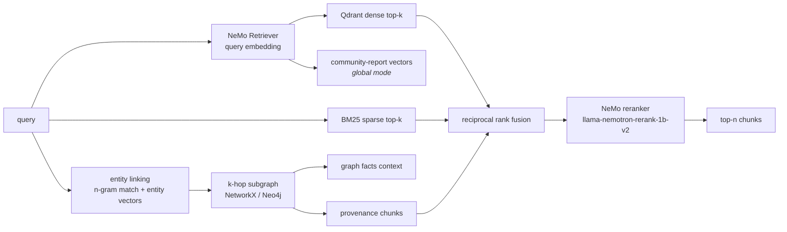
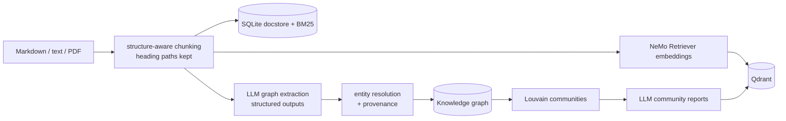

# Atlas: Adaptive GraphRAG Research Agent

**A production-style research agent that answers multi-hop and corpus-wide questions over private documents.**
It combines hybrid vector search, a knowledge graph and a self-correcting LangGraph workflow, and runs
entirely on NVIDIA NIM models.

 

 

Naive RAG (embed → top-k → generate) breaks in three predictable ways:

| Failure mode | Example | How Atlas handles it |
|---|---|---|
| **Multi-hop** questions whose facts live in different documents | *"Who is on call for the service whose schema change caused INC-2041?"* | Query decomposition, knowledge-graph traversal (incident → service → owner) and graph-guided chunk expansion |
| **Global** questions no single chunk can answer | *"What are the main reliability themes across incidents and the roadmap?"* | GraphRAG community detection (Louvain) + LLM community reports, retrieved as a separate index |
| **Silent failure** on weak evidence or hallucination | Confident answers built on irrelevant chunks | CRAG grading → query rewriting → web fallback, then a Self-RAG groundedness check with regeneration |

---

## Architecture

### Agent workflow (LangGraph)



Every loop is bounded (`max_rewrites`, `max_generation_retries`). Each node records a timed trace step that
is streamed to clients, so you can see *why* the agent answered the way it did.

### Retrieval



### Ingestion



Ingestion is idempotent: documents are checksummed, unchanged files are skipped, and changed files have their
chunks and vectors replaced.

---

## What's inside

| Capability | Implementation |
|---|---|
| **Adaptive routing** | Structured-output router picks `local`, `global`, `web` or `direct` and rewrites follow-ups into standalone questions using chat history ([`agent/graph.py`](src/atlas/agent/graph.py)) |
| **Query decomposition** | Multi-hop questions split into sub-questions, retrieved in parallel with `asyncio.gather` |
| **Hybrid retrieval** | Dense (Qdrant) + sparse (BM25) + graph provenance, fused with RRF, reranked by a NeMo cross-encoder ([`retrieval/retriever.py`](src/atlas/retrieval/retriever.py)) |
| **GraphRAG** | LLM entity/relation extraction with Pydantic schemas, entity resolution, k-hop traversal, Louvain communities and community reports ([`ingest/`](src/atlas/ingest)) |
| **Corrective RAG** | Batched relevance grading → bounded query rewriting → web fallback |
| **Self-RAG** | Groundedness and usefulness reflection; unsupported claims are fed back for regeneration, and answers that remain unverified are flagged |
| **Conversation memory** | LangGraph checkpointer keyed by `thread_id`; per-turn state and trace reset cleanly |
| **Streaming** | Token streaming via LangGraph custom stream mode → FastAPI SSE → Streamlit |
| **MCP server** | `ask`, `search`, `explore_entity`, `list_documents`, `ingest_text` tools with read-only/idempotent annotations, plus resources and a prompt ([`mcp_server.py`](src/atlas/mcp_server.py)) |
| **Provider abstraction** | The agent depends on `LLM` / `Embedder` / `Reranker` protocols. NVIDIA NIM is the production provider; deterministic offline providers run CI with no API key ([`providers/`](src/atlas/providers)) |
| **Resilient structured output** | NIM guided decoding first, then schema-in-prompt JSON parsing as a fallback; tenacity retries with backoff |
| **Prompt-injection hygiene** | Retrieved and web content is fenced in XML-tagged `<documents>` blocks, and the generator is told to treat it as data |
| **Evaluation** | Atlas vs. naive-RAG baseline on a golden set: LLM-as-judge correctness and faithfulness, source recall, MRR, abstention accuracy, latency p50/p95 ([`evals/`](src/atlas/evals)) |
| **Ops** | Structured JSON logs, optional API-key auth, health checks, multi-stage non-root Docker image, docker-compose with Qdrant + Neo4j, GitHub Actions CI |

### Models (NVIDIA API Catalog / NIM)

| Role | Default model | Why |
|---|---|---|
| Generator, graph extraction, community reports, eval judge | `nvidia/nemotron-3-super-120b-a12b` | Strong reasoning and synthesis |
| Router, grader, rewriter, reflection | `nvidia/nemotron-3-nano-30b-a3b` | Low latency for high-frequency control decisions |
| Embeddings | `nvidia/llama-nemotron-embed-1b-v2` | Asymmetric query/passage encoding |
| Reranker | `nvidia/llama-nemotron-rerank-1b-v2` | Cross-encoder precision on the fused candidate pool |

All models are configurable through environment variables. Setting `ATLAS_NVIDIA_BASE_URL` points the whole
stack at self-hosted NIM containers without code changes (for air-gapped or on-prem deployments).

---

## Quickstart

```bash
cd adaptive-graphrag
uv venv && uv pip install -e ".[dev,ui]"      # or: make install
cp .env.example .env                          # add your NVIDIA_API_KEY from build.nvidia.com

atlas ingest data/corpus                      # chunk, embed, extract graph, build communities
atlas ask --trace "Who is the primary on-call lead for the service whose schema change caused INC-2041?"
```

**No API key?** `make demo` runs the whole pipeline with the deterministic offline providers. They are
heuristic stand-ins that exercise every code path; they are not models.

### Run the services

```bash
atlas serve                 # FastAPI on :8000  (OpenAPI docs at /docs)
streamlit run ui/app.py     # UI on :8501: streaming chat, live agent trace, citations, graph explorer
docker compose up --build   # API + UI + Qdrant + Neo4j
```

```bash
curl -N -X POST localhost:8000/v1/ask/stream -H 'content-type: application/json' \
  -d '{"question": "Why did VisionCore 3.2 look better offline but fail in production?"}'
```

| Endpoint | Purpose |
|---|---|
| `POST /v1/ask` | Answer with citations, route, groundedness and trace |
| `POST /v1/ask/stream` | Server-sent events: `step`, `token`, `reset`, `final` |
| `POST /v1/ingest`, `POST /v1/ingest/files` | Ingest JSON text or uploaded md/txt/pdf |
| `GET /v1/graph`, `GET /v1/communities`, `GET /v1/documents` | Knowledge-base introspection |

### Use it from Claude Desktop, Cursor or any MCP client

```json
{
  "mcpServers": {
    "atlas": {
      "command": "/path/to/adaptive-graphrag/.venv/bin/atlas",
      "args": ["mcp"],
      "env": { "NVIDIA_API_KEY": "nvapi-...", "ATLAS_DATA_DIR": "/path/to/adaptive-graphrag/.atlas" }
    }
  }
}
```

Or serve over Streamable HTTP with `atlas mcp --http --port 8765` (endpoint `/mcp`).

---

## Evaluation

```bash
atlas eval    # writes reports/eval_report.md and reports/eval_report.json
```

The golden set ([`evals/golden.jsonl`](evals/golden.jsonl)) has 16 questions across single-hop, multi-hop,
global and unanswerable categories. Each one runs through both **Atlas** and a **naive-RAG baseline**
(dense top-k → single generation) with the same models, so the comparison isolates the architecture.

| Metric | How it's measured |
|---|---|
| Correctness | LLM judge vs. reference answer (0 / 0.5 / 1 rubric) |
| Faithfulness | LLM judge: fraction of claims supported by the retrieved context |
| Source recall / MRR | Exact: expected source documents vs. retrieved documents |
| Abstention accuracy | Unanswerable questions must be declined, not hallucinated |
| Latency p50 / p95 | Wall clock per question |

> Results depend on the models you run. Run `atlas eval` with your NVIDIA key and commit
> `reports/eval_report.md` to publish your numbers. CI runs the same harness in offline mode as a smoke test.

---

## Design decisions

- **Grade before generating, reflect after.** Grading uses a small model in a single batched call (one LLM
  call per round, not one per document). The expensive model runs once per answer unless reflection fails.
- **The graph is a retrieval signal, not only a context block.** Relation provenance feeds chunk IDs back into
  RRF, so graph hops surface the *source passages* the reranker can verify.
- **RRF over score blending.** Dense, BM25 and graph scores aren't comparable; rank fusion needs no tuning.
- **Contexts are stored in state as plain dicts,** so checkpoints stay JSON-serializable across checkpointer
  backends.
- **Neo4j without APOC.** A single `:REL {type}` relationship supports arbitrary LLM-extracted predicates;
  community detection runs client-side, so no GDS license is needed.
- **Protocols over frameworks.** LangChain is used only inside the NVIDIA adapter, which keeps the core
  testable and makes swapping providers (vLLM, Bedrock, Azure) a single-file change.

## Limitations and next steps

- The graph is additive: re-ingesting a changed document replaces its chunks but not its previously
  extracted facts. Next step: provenance-based fact expiry.
- BM25 is in-process. At scale, move to Qdrant sparse vectors or OpenSearch.
- Next: add a persistent checkpointer (Postgres) and OpenTelemetry tracing; add hierarchical (multi-level)
  community reports.

## Project layout

```
src/atlas/
  agent/        LangGraph state machine (routing, CRAG, Self-RAG, streaming, memory)
  retrieval/    hybrid + graph retriever, reciprocal rank fusion
  ingest/       loaders, chunking, graph extraction, communities
  stores/       Qdrant, SQLite docstore, BM25, NetworkX / Neo4j graph stores
  providers/    NVIDIA NIM adapters + offline deterministic providers
  api/          FastAPI (JSON + SSE)
  evals/        metrics + benchmark runner
  mcp_server.py MCP server (stdio / Streamable HTTP)
ui/app.py       Streamlit client
data/corpus/    synthetic enterprise knowledge base (fictional company)
tests/          unit, agent-behaviour, API and MCP integration tests (offline)
```

The demo corpus describes **Helix Dynamics, a fictional robotics company**. Its teams, services, incidents
and model cards are designed so that answering requires connecting facts across documents.
