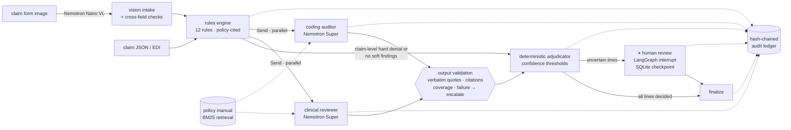

# Aegis: Multi-Agent Medical Claims Auditor

**A deterministic rules engine and LLM specialist agents audit medical claims together, with a human
reviewer for anything uncertain and a tamper-evident trail of every decision.** It's built on LangGraph
and NVIDIA NIM (Nemotron reasoning and vision models).

 
 


Claim auditing has two very different kinds of work:

- **Mechanical checks** (eligibility, timely filing, duplicates, bundling edits, unit limits) must be exact,
  consistent and explainable. An LLM adds risk here and no value.
- **Judgment calls** (does this note document a red flag that justifies an MRI? does it support a 99215?)
  need someone to *read* the documentation. Rules can't, and keyword matching gets negation wrong.

Aegis gives each kind of work to the right component and makes the boundary enforceable:

| | Who decides | Can an LLM change it? |
|---|---|---|
| **Hard findings**: eligibility, timely filing, duplicates, missing auth, bundling, units, age limits, network, NPI | Rules engine | **No.** These never reach an agent |
| **Soft findings**: medical necessity, emergency without auth, modifier 59, E/M level, charge outliers | Specialist agent proposes; deterministic adjudicator disposes | Only with verbatim evidence + a policy citation + confidence ≥ threshold |
| **Anything uncertain** | Human reviewer (durable pause) | — |

---

## Architecture



### Guardrails on the agents (`agents/reviewers.py`)

The LLM proposes; code decides whether the proposal is admissible.

- **Evidence must be verbatim.** Every quote must appear in the clinical note (whitespace- and
  case-normalized). Invented or paraphrased evidence makes an override inadmissible.
- **Citations must be real**, and an override must cite the finding's own policy section.
- **Full coverage.** Every assigned finding must be answered; missing answers are escalated.
- **No note, no override.** A soft finding can't be overturned without documentation.
- **Failures degrade to humans.** A timeout or malformed output becomes `escalate`, never a decision.
- **Prompt hygiene.** The clinical note and policy text are fenced as data, and the reviewer is told to
  ignore instructions inside them.

### Human in the loop that survives restarts

Uncertain lines pause the LangGraph run with `interrupt()`. State is checkpointed to SQLite with the claim
id as the thread id, so a claim can wait in the queue across deploys and be resumed by the API, the UI or
an MCP client. Resumption is validated: a reviewer can decide **only the pending lines**, and hard
denials are final.

### Tamper-evident audit trail (`audit/ledger.py`)

Every step is an append-only event: claim received, findings, each agent's model and validated output,
adjudication, the human decision, and finalization. Each event's SHA-256 hash covers its content and the
previous hash. Editing any historical row breaks verification from that row on, and a test proves it.

---

## Evaluation

```bash
aegis eval     # reports/eval_report.md
```

**Data.** 144 synthetic claims from 18 scenario families (24 labeled variants) with **injected, labeled anomalies** and expected line
outcomes ([`data/generate.py`](src/aegis/data/generate.py)). 56 claims need judgment: their correct outcome
depends on the clinical note. Note pools include **hard negatives** that name a policy criterion only to
negate it ("no focal neurological deficit", "no decision regarding hospitalization was needed").

**Three systems compared**

1. **Rules only:** every soft finding goes to a human.
2. **Rules + agents:** Aegis.
3. **LLM only:** one call per claim with the full policy manual and claim facts, no rules engine.

**Committed baseline** ([`reports/baseline_keyword_offline.md`](reports/baseline_keyword_offline.md)), with
the agents replaced by a deterministic **keyword matcher**:

| metric | rules only | rules + keyword "agents" |
|---|---|---|
| straight-through processing (no human) | 61.1% | 100.0% |
| claim accuracy (auto-decided) | 100.0% | 90.3% |
| judgment accuracy | n/a (all to humans) | 75.0% |
| **overpaid** (should deny, paid) | $0 | **$12,120** |
| underpaid (should pay, denied) | $0 | $2,200 |

The rules engine scores precision and recall of 1.000 on the injected anomalies. The tradeoff is clear:
rules alone are exact but send 39% of claims to a human. Keyword matching automates everything but pays
claims whose notes *mention* a criterion only to deny it. A reviewer model has to beat both: high
automation without overpayment, escalating when unsure. Run `aegis eval` with an `NVIDIA_API_KEY` to fill
in the Nemotron and LLM-only columns.

---

## Quickstart

```bash
cd claims-audit-agents
uv venv && uv pip install -e ".[dev,ui]"
cp .env.example .env                 # NVIDIA_API_KEY from build.nvidia.com
aegis eval                           # benchmark (data/ is committed and reproducible: `aegis generate`)
aegis serve                          # API on :8002
streamlit run ui/app.py              # submit claims, work the review queue, inspect the audit chain
docker compose up --build            # API + UI with a persistent state volume
```

No key? `AEGIS_PROVIDER=offline` runs everything with the keyword baseline.

| Endpoint | Purpose |
|---|---|
| `POST /v1/claims` | Audit a claim (JSON) |
| `POST /v1/claims/form` | Upload a claim-form image (+ optional clinical note): vision intake, then audit |
| `GET /v1/reviews` · `POST /v1/reviews/{id}` | Human review queue and decisions |
| `GET /v1/audit/{id}` | Audit events with chain verification |

**MCP** (`aegis mcp`): `audit_claim`, `claim_status`, `search_policy`, `review_queue`, `audit_trail`, and
`submit_human_review`. Human decisions are a separate non-read-only tool, so hosts can require approval.

### Vision intake

`POST /v1/claims/form` sends a CMS-1500-style image to `nvidia/nemotron-nano-12b-v2-vl`, then validates the
transcription before auditing: line charges must sum to box 28, the NPI must pass its check digit, and the
member, provider and codes must exist. A misread image goes to manual intake rather than being
adjudicated on wrong data.

---

## Project layout

```
config/          policy manual (citable AEG-x.y sections) + coding reference tables
src/aegis/
  rules/         deterministic rules engine
  agents/        specialist reviewers + output validation
  adjudicate.py  deterministic combination of findings and reviews
  workflow/      LangGraph graph (Send fan-out, interrupt, checkpointing)
  audit/         hash-chained ledger
  intake/        claim-form rendering + VLM extraction and validation
  policy/        policy manual parsing + BM25 retrieval
  data/          synthetic registry and labeled claim generator
  evals/         three-way benchmark
  api/ mcp_server.py cli.py service.py
data/            committed, reproducible synthetic dataset
tests/           rules, adjudication, agent validation, durable HITL, ledger tampering, intake, API, MCP
```

## Limitations and next steps

- The policy, codes and edits are a small synthetic subset modeled on common payer concepts. They are
  not real payer policy or clinical guidance.
- Next: calibrate the confidence thresholds on a dev split (reliability curve), and per-reviewer model
  routing (a smaller model for coding checks).
- Next: an LLM-generated member-friendly explanation of benefits, grounded in the ledger.

All members, providers, notes and claims are fictional.
