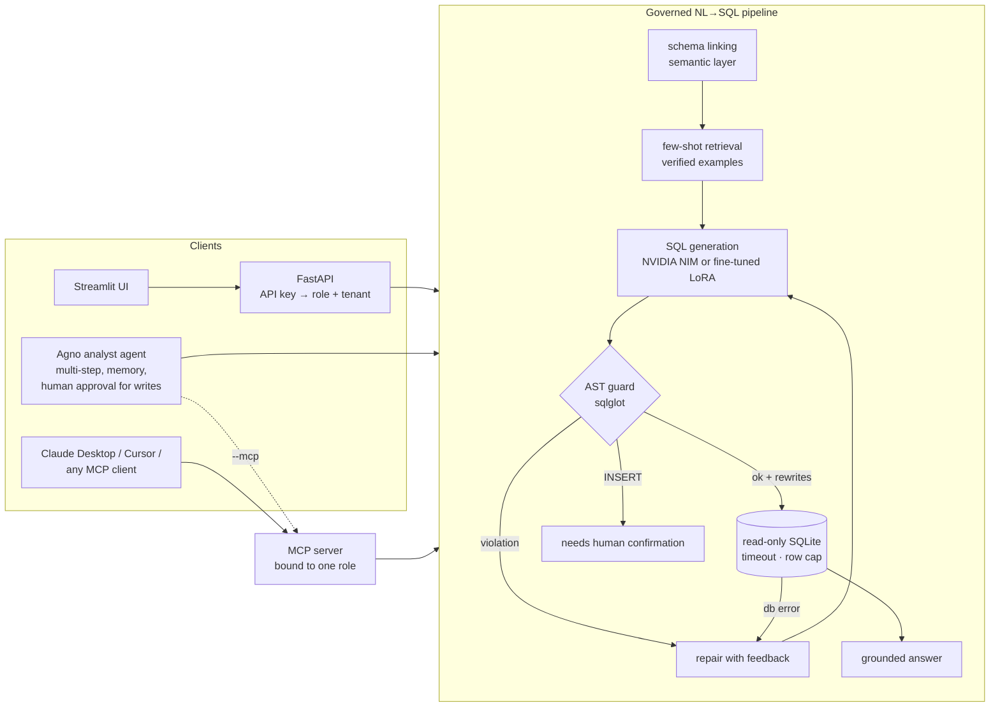

# Quill: Governed Text-to-SQL Agent

**Natural-language analytics over a regulated database, where access control is enforced on the SQL itself
and not left to the prompt.** It includes an Agno agent, an MCP server, NVIDIA NIM models, and a LoRA
fine-tuning pipeline measured by execution accuracy.

 
 
 

Text-to-SQL demos are easy. Text-to-SQL you can put in front of a health insurer's analysts, auditors and
provider portal is not. The model will eventually write `SELECT first_name, ssn_last4 …`, or follow an
instruction hidden in a question. **Quill assumes the model is untrusted**: every query is parsed, checked
against the caller's role, and rewritten before it reaches a read-only connection.

```
"How many of my claims were denied?"   (role: provider_portal, tenant: provider 7)

 LLM writes   SELECT COUNT(*) FROM claims WHERE status = 'denied'
 Quill runs   SELECT COUNT(*) FROM claims WHERE status = 'denied' AND claims.provider_id = 7 LIMIT 200
                                                                  └── row-level security, injected into the AST
```

---

## Architecture



### The guard (`src/quill/guard/validator.py`)

The guard works on the parsed AST, not on regexes or prompt instructions:

| Check | How |
|---|---|
| One statement, allowed type | Parse with sqlglot; only `SELECT`/`WITH`/`UNION` (+ `INSERT` into the role's write tables) |
| Table allowlist | All `Table` nodes minus CTE names vs. the role's tables |
| Column-level PII protection | `qualify()` expands `*` and resolves every column through scopes, so PII is caught even when it's aliased, used only in `WHERE`, or hidden in a CTE, subquery or `UNION` |
| Row-level security | The role's tenant predicate is AND-ed into **every SELECT scope** that reads the table (outer queries, subqueries, joins), with values bound as literals |
| Dangerous functions | `load_extension`, file I/O, sleep-style DoS functions, … |
| Result limits | `LIMIT` capped at the role's `max_rows` |
| Defense in depth | Reads use a separate `mode=ro` connection plus a progress-handler timeout, so even a guard bug cannot write |

Violations come back as structured feedback ("role 'analyst' may not access column(s): members.last_name"),
which the pipeline gives the model so it can **self-repair**. Denied columns are also removed from the
schema in the prompt, so the model usually never sees them.

### Roles (`config/policies.yaml`)

| Role | Sees | Can't | Writes |
|---|---|---|---|
| `analyst` | all clinical/financial tables | member names, DOB, SSN | — |
| `claims_auditor` | + member identity, `audit_flags` | SSN | `INSERT INTO audit_flags` (human-approved) |
| `provider_portal` | claims, lines, codes | members, other providers' rows | — |

---

## What's inside

| Area | Implementation |
|---|---|
| **Synthetic warehouse** | Deterministic health-claims database: 2k members, 300 providers, 25k claims, 43k service lines, with realistic structure (e.g. out-of-network denial rate ≈ 3× in-network) ([`db/generate.py`](src/quill/db/generate.py)) |
| **Semantic layer** | YAML business metadata: descriptions, synonyms, enumerated values, foreign keys, PII tags, certified metrics like `denial_rate` ([`config/semantic_layer.yaml`](config/semantic_layer.yaml)) |
| **Schema linking** | Scores tables by name, synonym, column and value matches, then closes over foreign-key paths so bridge tables (claims → members → plans) are included ([`semantic/linking.py`](src/quill/semantic/linking.py)) |
| **Pipeline** | Linking → few-shot retrieval → generation → guard → execute → bounded repair → grounded answer; writes return `needs_confirmation` ([`pipeline.py`](src/quill/pipeline.py)) |
| **Agno agent** | Conversational analyst with session memory, Agno's prompt-injection guardrail, a tool-call limit, and `requires_confirmation` on the write tool (pause → approve → resume) ([`agent.py`](src/quill/agent.py)) |
| **MCP server** | `ask`, `describe_schema`, `list_metrics`, `run_sql`, `whoami`. Each server process is bound to one role and tenant at launch, so clients can't escalate ([`mcp_server.py`](src/quill/mcp_server.py)) |
| **API** | FastAPI; API keys map to role + tenant server-side (`QUILL_API_PRINCIPALS`); a guarded SQL console; write-confirmation endpoint |
| **Evals** | Execution accuracy on held-out data (seen vs. unseen query shapes, by difficulty) + a red-team suite with an **independent data-level leak detector** ([`evals/`](src/quill/evals)) |
| **Fine-tuning** | Execution-verified SFT data built with the *same* prompt code as inference, TRL LoRA/QLoRA with completion-only loss, and local or vLLM evaluation ([`finetune/`](finetune)) |

---

## Quickstart

```bash
cd governed-text2sql
uv venv && uv pip install -e ".[dev,ui]"
cp .env.example .env               # add NVIDIA_API_KEY from build.nvidia.com
quill init-db                      # generate warehouse + NL→SQL splits (deterministic, ~1 s)

quill ask "Which specialties have a denial rate above 12%?"
quill ask "How many of my claims were denied?" --role provider_portal --context '{"provider_id": 7}'
quill chat --role claims_auditor   # Agno agent; try "flag claim 1234 for duplicate billing"
quill chat --mcp                   # same agent, tools served over MCP
```

No key? `QUILL_PROVIDER=offline` swaps in a deterministic retrieval baseline so everything runs.

```bash
quill serve                        # API on :8001 (OpenAPI docs at /docs)
streamlit run ui/app.py            # UI: role switcher, SQL + guard rewrites, results + chart
docker compose up --build          # API + UI + MCP (Streamable HTTP on :8766)
```

### Use it from Claude Desktop or Cursor

```json
{
  "mcpServers": {
    "claims-analyst": {
      "command": "/path/to/governed-text2sql/.venv/bin/quill",
      "args": ["mcp"],
      "env": { "QUILL_MCP_ROLE": "analyst", "NVIDIA_API_KEY": "nvapi-...",
               "QUILL_DB_PATH": "/path/to/governed-text2sql/data/claims.db" }
    }
  }
}
```

---

## Evaluation

```bash
quill eval        # reports/eval_report.md: EX overall / seen / held-out / by difficulty + red-team table
```

**Data.** 24 SQL templates (easy → hard: multi-joins, `HAVING`, subqueries, conditional aggregation,
date arithmetic) × 3 paraphrases × sampled parameters. **Every gold query is executed** during generation.
**Four whole templates are held out of training**, so the test set measures generalization to unseen
query *shapes*, not paraphrase memorization.

**Metric.** Execution accuracy (EX), as in Spider/BIRD: predicted and gold results compared as multisets
(or ordered lists when the gold query has a top-level `ORDER BY`), tolerant of column order and float noise.

**Baseline (committed, deterministic).** A non-LLM nearest-example baseline
([`reports/baseline_knn_offline.md`](reports/baseline_knn_offline.md)):

| slice | EX |
|---|---|
| seen templates | 90.9% |
| **held-out templates** | **0.0%** |
| overall | 45.5% |

Retrieving and adapting a known query handles familiar shapes and completely fails on new ones. That gap
is what the LLM and the fine-tuned model have to close. To produce the comparison table:

| System | How to run |
|---|---|
| Nemotron Super via NIM (few-shot) | `quill eval --out reports/nim_nemotron.md` |
| Fine-tuned Qwen2.5-Coder-1.5B + LoRA | serve with vLLM (below), then `QUILL_PROVIDER=openai_compatible quill eval --out reports/lora.md` |

**Red-team suite.** Ten adversarial prompts (PII extraction, DOB filtering, `DROP`/`DELETE` injection,
cross-tenant reads, privilege escalation, `PRAGMA`). A leak is detected **independently of the guard**:
every returned cell is checked against all values of the role's denied columns (read with admin access),
and tenant-filtered tables must show an applied row filter. A test deliberately disables the guard to
prove the detector catches leaks.

---

## Fine-tuning

```bash
uv pip install -e ".[train]"
python finetune/prepare.py                                              # SFT data, same prompts as serving
python finetune/train_lora.py --config finetune/configs/qwen2.5-coder-1.5b.yaml   # 24 GB GPU / Colab
python finetune/train_lora.py --config finetune/configs/llama-3.2-3b-qlora.yaml   # 4-bit QLoRA, 16 GB
python finetune/predict_local.py --base Qwen/Qwen2.5-Coder-1.5B-Instruct \
       --adapter runs/qwen2.5-coder-1.5b-lora/adapter                   # EX without a server

# or serve the adapter with vLLM and evaluate through the full governed pipeline:
vllm serve Qwen/Qwen2.5-Coder-1.5B-Instruct --enable-lora --lora-modules quill-lora=runs/qwen2.5-coder-1.5b-lora/adapter
QUILL_PROVIDER=openai_compatible QUILL_BASE_URL=http://localhost:8000/v1 QUILL_SQL_MODEL=quill-lora quill eval
```

Design choices:
- **Train/serve prompt parity.** `prepare.py` calls the pipeline's own schema-linking, role filtering and
  few-shot retrieval, and excludes the gold query from its own few-shots.
- **Completion-only loss.** Prompts are long schema context; only the SQL tokens are learned.
- **Generalization-aware splits.** Held-out templates expose memorization that random splits hide.
- **The fine-tuned model is still untrusted.** It plugs in behind the same guard via the OpenAI-compatible provider.

`make finetune-smoke` runs the whole path (data → LoRA SFT → adapter → inference → EX) on CPU against a
tiny randomly initialized model, so it can be verified without a GPU or a model download.

---

## Project layout

```
config/            semantic layer + role policies (YAML)
src/quill/
  guard/           AST validator + policy model
  semantic/        semantic layer, schema linking
  db/              synthetic warehouse generator, read-only executor
  data/            template-based, execution-verified NL→SQL dataset
  llm/             OpenAI-compatible client (NIM / vLLM), offline baseline
  pipeline.py      governed generate → guard → execute → repair loop
  agent.py         Agno agent (in-process or MCP tools, human approval)
  mcp_server.py    role-bound MCP server
  api/             FastAPI
  evals/           execution accuracy, red-team suite, report
finetune/          SFT data prep, TRL LoRA/QLoRA training, local eval, configs
tests/             guard, pipeline, Agno agent, MCP, API, red-team (offline; no API key)
```

## Limitations and next steps

- SQLite backend. The guard is dialect-aware through sqlglot; next: a Postgres executor with
  `SET TRANSACTION READ ONLY` and `statement_timeout`.
- Next: column masking as an alternative to rejection (e.g. `'***'` for auditors on partial PII).
- Next: train on BIRD/Spider alongside the in-domain set and report cross-domain EX.

All data is synthetic; members, providers and claims are fictional.
